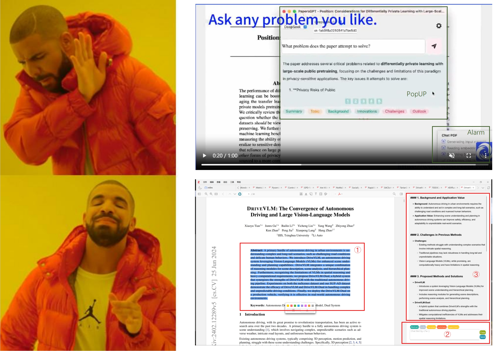

# 📚 PapersGPT for Zotero - Modified Version by c7w



## ✨ Features

### 🖥️ **Chatbot in the Sidebar**  
- The chatbot has been moved from the popup menu to the **sidebar** for a smoother, more integrated experience.

### ✋ **Drag-and-Query on the Fly**  
- Simply **drag and select** text within Zotero to instantly query the chatbot. No extra steps needed! ⚡

### 🔒 **Customized LLM API Support**  
- All online authentication mechanisms of PapersGPT have been **disabled**.  
- Only supports LLMs of OpenAI API format with the following options:  
  - `base_url`  
  - `model_name`  
  - `api_key`  

### 🛠️ **Customizable Prompt Design**  
- Create and use your own **custom prompts** via the configuration settings. 🎨

## ⚙️ Configuration

### Install the Plugin

To install a plugin in Zotero, download its .xpi file to your computer (from releases in the right panel). Then, in Zotero, click “Tools → Plugins” and drag the .xpi onto the Plugins window.

### 🔍 Where Can I Find the Configuration?

The configuration file for this modified version of PapersGPT is located in Zotero's **profile directory**. You can find your Zotero profile directory in the following locations, depending on your operating system:

| 🖥️ **Operating System** | 📂 **Path to Profile Directory**                                                                                                                                                                                                                 |
|--------------------------|--------------------------------------------------------------------------------------------------------------------------------------------------------------------------------------------------------------------------------------------------|
| **Mac**                 | `/Users/<username>/Library/Application Support/Zotero/Profiles/<randomstring>` <br> **Note:** The `/Library` folder is hidden by default. To access it, click on your desktop, hold down the `Option` key, and click **Go > Library** in the menu. |
| **Windows 11/10/8/7/Vista** | `C:\Users\<User Name>\AppData\Roaming\Zotero\Zotero\Profiles\<randomstring>` <br> **Note:** If `AppData` is hidden, open the search bar (or Start menu in older versions), type `%appdata%`, and press Enter to navigate to the `AppData\Roaming` directory. |
| **Windows XP/2000**      | `C:\Documents and Settings\<username>\Application Data\Zotero\Zotero\Profiles\<randomstring>`                                                                                                                                                |
| **Linux**                | `~/.zotero/zotero/<randomstring>`            |


Locate `prefs.js` within that folder with random string.


### 🛠️ How to Modify the Configuration

After installing the plugin and restart Zotero (you can look at the dev console to see a prompt like `Setting default values for custom model`), you can modify the user profile (located above). The following fields can be modified. **NOTE THAT THE FIRST THREE KEYS START WITH `custom`**, NOT `using`!!!

1. **API Key**: Set your custom API key for authentication.  
   ```javascript
   user_pref("extensions.zotero.PapersGPT.customModelApiKey", "your-api-key-here");
   ```

2. **Model Name**: Specify the LLM model to use (e.g., `gpt-4o`).  
   ```javascript
   user_pref("extensions.zotero.PapersGPT.customModelApiModel", "gpt-4o");
   ```

3. **API URL**: Define the endpoint of your custom LLM server.  
   ```javascript
   user_pref("extensions.zotero.PapersGPT.customModelApiUrl", "http://your-server-url/v1/chat/completions");
   ```

4. **Custom Prompts**: Add or edit JSON-based prompts for tasks like summarization, translation, etc.  
   ```javascript
   user_pref("extensions.zotero.PapersGPT.prompts", "[{\"name\":\"Summary\",\"prompt\":\"Summarize the text...\"}]");
   ```

### Customized Prompt in Detail

The value must be a list of `interface Prompt`:

```typescript
interface Prompt {
  name: string
  read_selection: boolean
  description: string
  prompt: string
  display: {
    color: string
    priority: number
  }
}

```

Below is an example of a customized prompt designed to summarize the abstract of a research paper. This prompt provides detailed instructions for the chatbot's behavior.

```typescript
{
  name: "Abstract",  // Task name
  read_selection: true,  // Reads selected text in Zotero. If this is false, only the prompt below will be sent to the GPT, and selection wont be considered.
  description: "Given abstract, summarize it.",  // Brief description of the task
  prompt: `# 角色
你是文献摘要助手，具备快速阅读和理解机器学习文献的能力。
# 工作任务
你的输入是文献的摘要部分，或简介部分，或两者均有。
1. 理解工作的背景与应用价值。
2. 分析之前方法的做法与挑战。
3. 概述采用的方法与对应的解决挑战。
4. 汇总实验过程与结论。
5. 归纳其他摘要中提到的点。
6. 输出完所有要点后，请根据你的理解，提出几个在这一部分还没有写清楚的问题，以及你认为可以进一步探讨的方向。
# 注意事项
- 确保文献内容准确无误。
- 输出格式需遵循Markdown规范。
- 分点作答，分点作答，分点作答！（把每一点放到四级标题里）
- 保持英文输出。
- 输出尽可能简洁明了，同一个点表达出意思即可，不必过多展开。
- 当你遇到数学公式时，请使用 $...$ 包裹行内公式，使用 $...$ 包裹块公式。注意不要使用 \(...\) 和 \[...\]。
# 输入摘要`,
  display: {
    color: "#0EA293",  // Display color in the UI
    priority: 10  // Priority for ordering in the interface (lower appears first)
  }
}
```

Note that the `Send` button in sidebar can also be viewed as an instance of Prompt with prompt dynamically read from the input element. The `read_selection` can be regarded as set to true.

## Recommendation Usage

- Select `Abstract + Introduction`, and Click `Abstract` to summarize
- Select a subsection of `Method`, and Click `Bullet` to chunkize the text for faster reading
- Select `Any Text`, and Type in the input area for querying


## Development

```bash
npm install

# Modify scripts/zotero-cmd.json to put your zotero executable here. (you may install one in Unix development environment and use X11 forwarding)

node scripts/build.js && npm run start-z7   # build and debug

# Relase your built plugin from builds/papersgpt.xpi

```

Feel free to contribute, report issues, or suggest features! 😊

